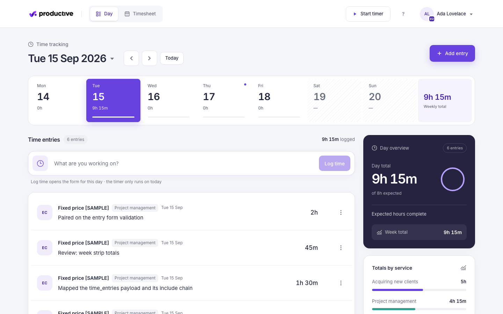
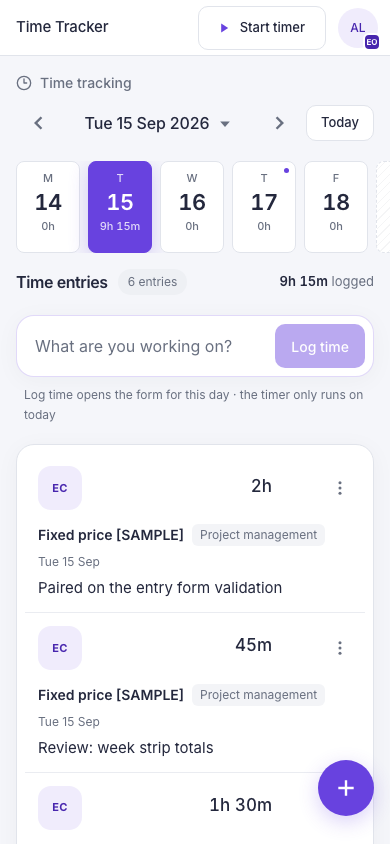
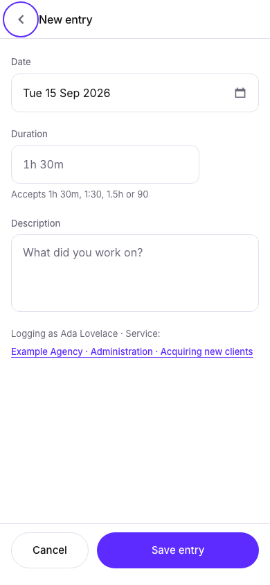

# Productive Time Tracker

A client-side time tracker for [Productive](https://www.productive.io/). Log in with an API token
and organization ID, then list, add, edit and delete your own time entries for any day. No
server-side code: the browser talks to the Productive API directly.



Technical specification: [`docs/SPEC.md`](docs/SPEC.md) · Decisions: [`docs/adr/`](docs/adr/) ·
API notes: [`docs/api/README.md`](docs/api/README.md), what the Productive API actually does,
established by recording real responses into [`docs/api/samples/`](docs/api/samples/)

## Quick start

```sh
nvm use                # Node 22 (.nvmrc)
corepack enable        # pnpm 12
pnpm install
```

**Without a Productive account** — runs against mock handlers, no credentials needed:

```sh
pnpm dev:mock          # http://localhost:5173, any token and org ID will do
```

**Against the real API:**

```sh
cp .env.example .env   # sets VITE_API_BASE_URL=https://api.productive.io/api/v2
pnpm dev
```

Then log in with an **API token** and an **organization ID**. Both are in Productive under
**Settings → API integrations**: the organization ID is shown at the top of that screen, and the
token is created there too.

Credentials are never in the repo, the `.env` file or the build. You type them on the login screen
and they live in `localStorage` ([ADR-0004](docs/adr/0004-credentials-in-browser.md)); logging out
clears them.

## What it does

|                |                                                                                                                  |
| -------------- | ---------------------------------------------------------------------------------------------------------------- |
| **Log in**     | API token and organization ID, resolved to the person who owns the entries. Survives a refresh; logout clears it |
| **View a day** | The entries for a date, with the surrounding week and totals by service. Empty, loading and error states         |
| **Add**        | Duration, date and description. The person is set from the session, never typed                                  |
| **Edit**       | In its own route (`/entries/:id/edit`), deep-linkable                                                            |
| **Delete**     | Behind a confirmation naming the entry, from the list or the edit form                                           |

Beyond the assignment: a running timer with idle detection, a week strip and timesheet grid,
keyboard shortcuts (`?` lists them), duplicate and copy-a-day-forward, start/end range entry, and
rich-text descriptions that round-trip with Productive's own editor
([ADR-0010](docs/adr/0010-rich-text-notes.md)).

<p>
  
  
</p>

More screens: [`docs/screenshots/`](docs/screenshots/).

## Scripts

| Script            | What it does                                                  |
| ----------------- | ------------------------------------------------------------- |
| `pnpm dev`        | Vite dev server against the real Productive API               |
| `pnpm dev:mock`   | Same, but against MSW handlers — no credentials needed        |
| `pnpm build`      | Type-check, then build to `dist/`                             |
| `pnpm preview`    | Serve the production build                                    |
| `pnpm typecheck`  | `tsc -b`, no emit                                             |
| `pnpm lint`       | ESLint, type-aware rules plus Prettier                        |
| `pnpm format`     | Prettier over the repo                                        |
| `pnpm test`       | Vitest: unit and component tests                              |
| `pnpm test:e2e`   | Playwright, desktop and a mobile subset, served by `dev:mock` |
| `pnpm api:sample` | Record one live API response into `docs/api/samples/`         |

End-to-end tests never hit the real API — they run against MSW so CI stays deterministic and
secret-free ([ADR-0003](docs/adr/0003-testing.md)).

## Working on it

The API layer is built from recorded responses rather than from the published reference alone,
because the two disagree in ways that matter — unknown filters are ignored rather than rejected,
and stopping a timer is `PUT`, not `POST`. `docs/api/README.md` records each of those with the
response that established it, and `pnpm api:sample` records a new one. That needs a `.env.local`
holding a real token and organization ID; it is gitignored, the app itself never reads it, and
`docs/api/README.md` lists the variable names.

### Developing with a coding agent

The assignment encourages using one, so the setup is committed rather than hidden. `CLAUDE.md` loads
every session; the rules load only when a file they cover is opened, so they cost nothing until they
apply:

| Rule                  | Applies to                                                                  |
| --------------------- | --------------------------------------------------------------------------- |
| `rules/guidebook.md`  | `src/**` — component layout, naming, hooks, accessibility                   |
| `rules/api-client.md` | `src/api/**` — JSON:API constraints, how to settle a question about the API |
| `rules/testing.md`    | tests and `e2e/**`                                                          |
| `rules/git.md`        | everywhere — commit and PR format                                           |

Three skills carry the repeatable parts — `/feature`, `/pr`, `/release` — and two subagents do the
reading: `api-explorer` answers endpoint questions from the recorded samples, and `reviewer` reads a
diff against the spec and the conventions. Adding a feature is `/feature <name>`, then the gate
(`pnpm lint && pnpm typecheck && pnpm test && pnpm test:e2e`), then `/pr`.

## Known limitations

Worth saying plainly rather than leaving to be found:

- **Nothing detects API drift.** The tests run against recorded responses through MSW, so the suite
  would stay green against a shape the API no longer sends. Responses are validated at runtime, so
  the app itself fails loudly rather than silently — but only a person re-running `pnpm api:sample`
  finds out that the recordings have aged.
- **An entry does not remember it was logged as a range.** Productive stores minutes and nothing
  else, so `09:00`–`10:30` reopens as `1h 30m`.

## Notes

The interface deliberately reuses Productive's wordmark and accent purple: this is a tool for
Productive's own product, and matching the parent app is the point rather than a liberty taken.
Swap the tokens in `src/styles/index.css` to rebrand it.

Code conventions follow [Infinum's Frontend Handbook](https://infinum.com/handbook/frontend).
Commits follow [Conventional Commits](https://www.conventionalcommits.org/), enforced by
`commitlint`.
